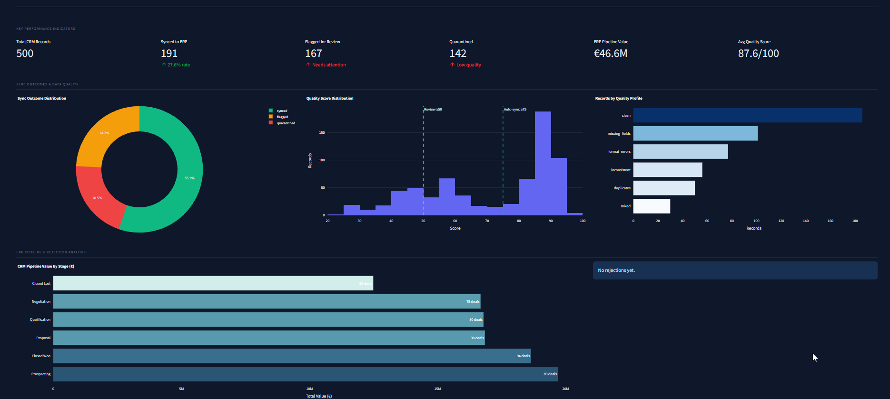
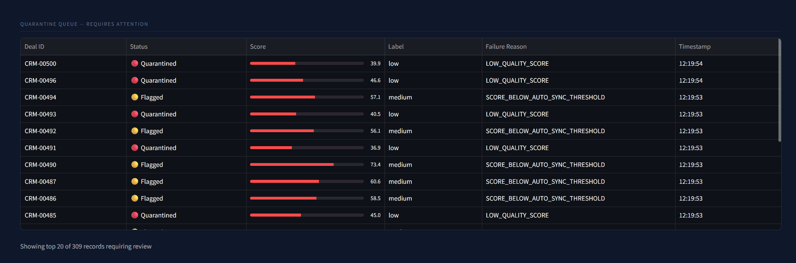
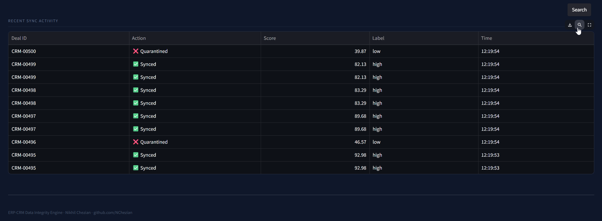

# ERP-CRM Data Integrity Engine

**End-to-end system that syncs business records between CRM and ERP, scores data quality using a regression ML model, and surfaces real-time insights to executives via a Streamlit dashboard.**

---



---

## The Problem This Solves

In most mid-to-large enterprises, a deal closes in CRM — but ERP, invoicing, and revenue forecasting don't know about it for hours, sometimes days. Someone in ops manually reconciles the gap. The C-suite makes decisions on stale, inconsistent data.

This project eliminates that gap with three layers:

1. **Automated sync** — n8n polls CRM every 5 minutes and pushes records to ERP
2. **ML-powered quality scoring** — each record is scored 0–100 before it ever reaches ERP; low-quality records are quarantined automatically
3. **Executive visibility** — a real-time dashboard converts sync events into business-readable KPIs

---

## Architecture

```
[Mock CRM API]  ──── n8n polls every 5 min ────▶  [n8n Workflow]
                                                         │
                                          ┌──────────────┴──────────────┐
                                          ▼                             ▼
                                  [ML Quality Scorer]           score < 50
                                  GradientBoosting              → Quarantine
                                  Regression (0–100)
                                          │
                                    score ≥ 75
                                          ▼
                                  [Mock ERP API]
                                          │
                                   50 ≤ score < 75
                                   → Flagged for Review
                                          │
                                  ┌───────┴───────┐
                                  ▼               ▼
                              [SQLite           [Streamlit
                              sync_log]          Dashboard]
                                              C-Suite View
```

---

## Tech Stack

| Layer | Technology |
|---|---|
| Mock APIs | Python, Flask |
| Data generation | Faker, SQLite |
| Orchestration | n8n (Docker) |
| ML model | scikit-learn, GradientBoostingRegressor |
| Dashboard | Streamlit, Plotly |
| Containerisation | Docker Compose |

---

## ML Model: Data Quality Scorer

The quality scorer is a **GradientBoostingRegressor** trained on 15 engineered features:

| Feature | Signal |
|---|---|
| `completeness_ratio` | Fraction of required fields present |
| `email_valid` | RFC-format email check |
| `phone_valid` | Digit-only phone format |
| `currency_valid` | ISO 4217 currency code |
| `date_valid` | Format + range sanity (not past, not >2yr future) |
| `value_positive` | Deal value > 0 |
| `value_in_range` | Deal value within ERP limits |
| `email_domain_quality` | Business domain heuristic |
| `company_name_len` | Length heuristic (very short = suspicious) |

**Model performance on held-out test set:**
- MAE: ~6.5 score points
- R²: 0.80

**Routing thresholds:**
- Score ≥ 75 → Auto-synced to ERP
- Score 50–74 → Flagged for human review
- Score < 50 → Quarantined

---

## Data Quality Profiles

The synthetic dataset simulates real-world CRM data decay across 6 profiles:

| Profile | Share | Issues Injected |
|---|---|---|
| `clean` | 40% | None |
| `missing_fields` | 20% | Null phone, industry, region |
| `format_errors` | 15% | Malformed email, phone, date format |
| `inconsistent` | 10% | Negative deal values, far-future dates, invalid currency |
| `duplicates` | 10% | Repeated email or company across records |
| `mixed` | 5% | Multiple issue types combined |

---

## Dashboard





The Streamlit executive dashboard provides:

- **KPI row** — Total records, synced count, flagged queue, quarantine count, ERP pipeline value (€), average quality score
- **Sync outcome donut** — Synced / Flagged / Quarantined split
- **Quality score histogram** — With threshold markers at 50 and 75
- **Records by quality profile** — Bar chart of CRM data health
- **Pipeline value by stage** — CRM funnel in EUR
- **Top ERP rejection reasons** — Parsed from ERP validation codes
- **Quarantine queue** — Live table with score progress bars
- **Recent sync activity** — Last 10 events with action status

---

## Quick Start

**Prerequisites:** Python 3.10+, pip. Docker Desktop only needed for n8n.

```powershell
# Clone and install
git clone https://github.com/NChezian/erp-crm-sync-engine
cd erp-crm-sync-engine
pip install -r requirements.txt

# Generate 500 synthetic CRM records
cd data_generator
python generate_data.py
cd ..

# Train the ML quality scorer
cd ml_scorer
$env:DB_PATH = "..\data\sync_engine.db"
python train_scorer.py
cd ..

# Run the full sync pipeline
$env:DB_PATH = "data\sync_engine.db"
python sync_bridge.py --all

# Launch dashboard
cd dashboard
$env:DB_PATH = "..\data\sync_engine.db"
streamlit run app.py
```

---

## API Reference

### CRM API — port 5001

```
GET  /health
GET  /api/deals?synced=0&limit=50
GET  /api/deals/{id}
GET  /api/deals/stats
PATCH /api/deals/{id}/mark-synced
POST /api/deals
```

### ERP API — port 5002

```
GET  /health
POST /api/orders
GET  /api/orders
GET  /api/rejections
GET  /api/stats
```

### ML Scorer API — port 5003

```
GET  /health
POST /score
POST /score/batch
```

---

## n8n Workflow

Import `n8n_workflows/sync_workflow.json` into your n8n instance.

The workflow runs every 5 minutes:
1. Polls CRM for unsynced deals
2. Splits into individual records
3. Scores each via ML Scorer API
4. Routes: score ≥ 75 → ERP, else → quarantine log
5. Marks accepted deals as synced in CRM

---

## Docker (Full Stack)

```bash
# First: generate data and train model locally
python data_generator/generate_data.py
python ml_scorer/train_scorer.py

# Then launch full stack
docker-compose up
```

Services:
- CRM API: http://localhost:5001
- ERP API: http://localhost:5002
- ML Scorer: http://localhost:5003
- Dashboard: http://localhost:8501
- n8n: http://localhost:5678 (admin / sync_engine_2024)

---

## Portfolio Context

This project sits at the intersection of three enterprise IT disciplines:

- **ERP/CRM integration** — the most common data pain point in Mittelstand companies
- **Proactive data quality** — ML scoring before records corrupt downstream systems
- **Executive visibility** — translating technical sync events into business KPIs

It pairs with the [HCRA Pipeline](https://github.com/NChezian/hcra-pipeline) (people workflow automation) and [AIOps Suite](https://github.com/NChezian/aiops-log-anomaly) (system reliability) to form a complete enterprise automation portfolio.

---

*Built by Nikhil Chezian · [github.com/NChezian](https://github.com/NChezian)*
